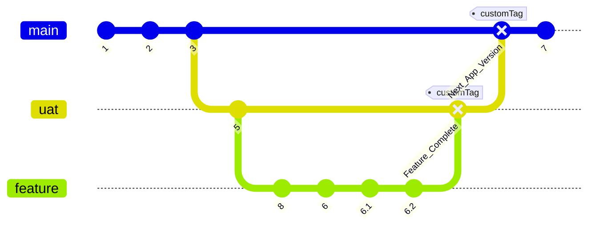

# Advanced Software Engineering Summative 2 - Country Information Lookup App [](https://opensource.org/licenses/MIT)

## Project background
One of the UK Government department's software delivery team currently maintains a legacy ASP.Net MVC application.
The team wanted to move away from legacy technology to latest JavaScript frameworks.
A spike was undertaken to explore React. The following application was proposed and developed
as proof of concept to assess for its suitability for the business use case.

## Application
Country information lookup application provides user with a search functionality to look up country details
using a few options available as part of select dropdown (i.e., search by name, code or capital). It interfaces with a 
free [REST COUNTRIES APIs] (https://restcountries.com/) to query country information from. The existing MVC application has 
similar functionality wherein the views render data collated from various backend apis (internal as well as external). The application
was focussed mainly on assessing React's offerings in terms of making use of React Hooks to pull in data from different providers and 
pass to the presentation layer.

The application makes use of fetch api to make REST api calls. REST apis are stateless interactions between two services to enable data 
operations such as GET, POST, DELETE etc. REST calls operate on top on application layer and HTTP protocol which helps with inter-operability 
between heterogenous systems over the internet. 

## Application urls
[Live](https://live-countrylookup.netlify.app/)

[UAT](https://uat-countrylookup.netlify.app/)

## Application design
Once a good understanding and consolidation of business requirements are achieved, it is then required to identify how the system needs to be 
designed. It is imperative that application design phase must not be treated as an opportunity to design solution. On the contrary, it is perfect 
opportunity to explore and discuss various possible solutions, designs and prototypes. 
User experience (UX) designers have different view about design thinking. Some perceive it as a process, set of tools and techniques while others
see it more of developing user centric mindset. User experience design processes has several steps before a design is finalised.

- Research / Empathise
Developing a system with its end users in mind throughout the process ensure that it is fit for purpose and delivers value. Designers need to empathise with
users needs and pain points while interacting with a system. Active non judgemental listening, asking the right questions, being unbiased by one's
own perception and ideas are some of the skills that a designer needs to develop. Researching about how the users feel, think and say about the product
will give the designer a picture of users' expectations. Some of the techniques to achieve this are by conducting surveys, user interviews, etc

- Define the user problem
The next stage is to identify the key themes that are voiced by the users as part of the research phase. Its identifying common patterns, and gain insight 
into problem areas which stood out significantly. These are then translated into a point of view (POV). POV ties users' needs to insight gained through user feedback.
This will essentially form a design problem that will need to be addressed by the resulting design prototype in the subsequent design stages.

- Design
POV is then used as a requirement to thought shower ideas to analyse different ideas to solve the design challenge. Conscious effort needs to be made to 
explore, encourage all ideas avoiding judgement and pre-mature commitment. The more the ideas, the better and balanced the approach to solving the problem will be.
Resisting the urge to commit to an idea without considering and ruling out others increases risk of developing a design that would not completely
meet POV.

In order to evaluate the ideas generated, each proposal must be carefully calibrated against following factors - cost, time, resources, risk, business value delivered.
Evaluation will highlight the design proposal that will be satisfy the POV and can be delivered realistically within the constraints.

- Prototype
Prototyping follows once we have a design finalised. It involves building model that are built to the design specification. They can be in various forms such as sketches, wireframes, mocks, paper etc. Idea is to build a model with user problem in mind as defined by POV. Evaluating and building iteratively is the aim of building a prototype. Similar to design phase, defer commitment to a given model.

 As opposed to Hi-Fi prototypes,
 Prototype can either be Low Fidelity (Lo-Fi) or High Fidelity (Hi-Fi) depending on the level of detail that it provides. Low - Fidelity prototypes are grey scaled and have minimal content in terms of colour, font. Lo-Fi resembles sketches and do not have images, branding elements in them. Whereas, Hi-Fi prototypes have enriched design elements, brand imagery, clickable and interactive.

- Validate
Once the prototype gets modelled, it is then required to be shared with real users or stakeholders to test its usability. It can be an iterative process wherein the feedback on the prototype is then incorporated into it before it can then progress to active development phase. This stage is gatekeeper for the build stage.

- Build and  QA Test
The validated design is then built by the development team and tested as part of the testing phase in iterations.
Any issues, defects found are then fixed before it can be launched.

- Launch
Quality assurance cleared design is then finally released for the end users to interact and use.


Application design was developed using popular design prototyping tool [Figma] (https://www.figma.com/ui-design-tool/). 
Figma enables team collaboration during product design phase so that the entire team has visibility and can contribute 
towards enhancing the design in the best way possible for the end user. In comparison to similar design tools such as Miro, Lucid chart, 
Figma outperforms them in developing faster application layouts, animations. Its library has several built-in UI components to serve different 
design and diagramming needs. Figma makes design development transparent to the wider team. As a result, it is very convenient for designers to
seek feedback without the hassle of exporting files out to share. The editing is very close to live and enables on the fly feedback gathering.

Two prototypes were created and presented to the team.  The second prototype below was agreed to the best of the two. The second 
prototype was much preferred due to its visual appeal, simplicity, better colour contrast, font styles and labelled input boxes.

It was interesting working on developing the prototype as the designer needs to be very effective communicator and good listener. These communication skills
are very crucial so that the pain points, expectations and suggestions from the end user perspective are captured accurately and unambiguously.

Prototypes produced below are fairly High-Fidelity (Hi-Fi) but they did not fully mock the clickable button.

Initial Prototype: 


Final Prototype:


A couple of iterations and review by the team 
helped to finalise the application design [here](https://www.figma.com/file/89BETzEeS63MILHXE0Apfs/Demo-App?node-id=0%3A1&mode=dev)

## Technical stack
* [HTML](https://devdocs.io/html/)
* [CSS](https://devdocs.io/css/)
* [React](https://devdocs.io/react/)
* [Jest](https://jestjs.io/docs/getting-started)
* [React Testing Library](https://testing-library.com/)
* [Cypress Testing](https://www.cypress.io/)
* [Netlify](https://www.netlify.com/)

## Project Management
Projects are generally short lived with a fixed schedule. To keep to its plan, a project needs to be managed correctly and regularly. There are tools and techniques that are used to monitor and track project delivery progress. There are project management boards such as Azure DevOps, Jira, GitHub Projects, Trello etc that make this lifecycle of a project visible. The project management boards are collaborative and help develop shared understanding of the progress. It gives the stakeholders a clear and true picture of the status quo. The board is divided into vertical columns or swim lanes denoting the different phases of software development lifecycle. The work is divided into smaller, manageable and time boxed items as issues. 

In context of the country lookup application, project delivery was managed using GitHub Projects due to easy of integrating with GitHub repository. A Kanban board was setup to identify issues that mapped to a set of milestones in the project lifecycle. Issues are marked with relevant labels and milestones to tie them back to the high level requirements and business value that they will align against. Kanban board was the suitable board view as it is easy to visualise and assess Work in progress (WIP) limit and pull more issues in development. The project board consists of four columns as mentioned below.

- Todo (when new issue is created)
- In Progress (to indicate which features are being built)
- In Test (to identify features undergoing testing)
- Done (features that have passed quality analysis and signed off by the Product Owner)

Issues are written in user story format. User story needs to be 
Independent (self contained without depending on other tasks), 
Negotiable ( can evolve as more clarity is gained about the work), 
Valuable, 
Estimatable, 
Small(can be acheived within fixed time frame),
Testable.  

User story card has description section to describe the problem statement. It is written with below format taking into consideration the role or user persona, and criteria to be met in order to complete it.
As a<> I want to <> so that <>

The acceptance criteria give development team of what needs to be delivery to complete the task. User stories are generally part of a feature. Features form part of an epic. 


Estimation
Teams estimate user stories/ issues to better gauge the effort required to complete the implementation. There are different estimation techniques that agile teams employ such as story pointing, t-shirt sizing, affinity estimation to name a few. 

Sprint planning
Sprint planning event in agile scrum working aims to review the product backlog for issues / stories that re ready to be played into a given sprint. The Product owner proposes the sprint goal and the team collectively then identifies the work items that will be required to deliver the goal. 

Product backlog refinement
In order for the sprint planning to run smoothly, it is generally advised to regularly revisit and refine product backlog such that there is three sprints' worth of work in the pipeline that can be picked up. Adhering to agile principles, team need to defer early commitment as the issues can change with time as more understanding emerges as the build progresses.

While working on the application, it was obvious that the scum master has to keep on top of the board so that it is organised and that the team is well conversant with the ways of working.

This project was bootstrapped with [Create React App](https://github.com/facebook/create-react-app).

## Prerequisites to run the application locally 
```sh
node -v
```
```sh
npm -v
```
If they are not installed on your local machine, then refer to the setup instructions [here](https://docs.npmjs.com/downloading-and-installing-node-js-and-npm).

## 1. Clone the repository:

```sh
git clone https://github.com/developer4551/ase2-countryinfolookup.git
```

## 2. Run Scripts to launch application
```sh
npm start
```

Runs the app in the development mode.\
Open [http://localhost:3000](http://localhost:3000) to view it in your browser.

## 3. Run unit tests

```sh
npm test
```
```sh
a
```

## 4. Run end to end tests

```sh
npx cypress open
```
More information on how to run tests can be found [here] (https://facebook.github.io/create-react-app/docs/running-tests).

## Branching and deployment strategies

There are two code branches of the repository namely main and uat. Main is the code version of application that is  representative of the Live system. uat branch signifies the next application version bundled with new features. Developers branch off uat from main to mark the start of next development iteration of the product. Each feature branch is forked from uat branch and is then synched with other parallel feature development. Once all the features have been built that form part of next release, the uat branch is then merged back to main. The branch tag on main at this point signifies the point at which the new changes are merged onto main. The uat branch undergoes final round of testing by users to verify system requirements been met, more on this has been discussed in the testing section of this report. See [V-model] (https://www.proquest.com/docview/1443699838?accountid=12085&forcedol=true&forcedol=true#)
in software development.

Branch protection policies
Branch protection policies have been put in place to avoid accidental pull request merge to main branch. Also, a minimum of one reviewer is required to approve the pull request. All checks including build pipelines and Netlify deployments need to complete successfully before any new code can be merged on to main branch. Reflecting on this strategy, it was a blocker while working on the respoitory as the only developer. However, this should not be the case in workplace. 

Mermaid Diagram 



## Continuous integration
As multiple developers collaboratively work on a shared code base, it is important to check if the new commits maintain the integrity of code base by running 
continuous build and tests. This helps to avoid any breaking changes from being committed to main branch. Continuous integration captures any regression testing 
issues with each pull request prior to merging with main.
[GitHub Actions](https://github.com/features/actions) provide simple way of setting up software workflow such that it gets builds, tests and deploys. The virtual 
build servers can run and test your application on a different host operating system and runtimes. Different combination of runtimes can be configurable to test 
the application in. 

Live Continuous integration status: [](https://github.com/developer4551/ase2-countryinfolookup/actions/workflows/prod.yml)

In the application, GitHub Action for Continuous integration of Node.js project has been used. As shown in the screenshot below, Node.js GitHub action builds, tests and runs end to end cypress tests as the development team iteratively adds new feature to the code base. It uses setup-node GitHub action primarily sets up the runner with required dependencies for a given node version listed in node-version array. This feature of GitHub action of being able to test application on different hosts with both old and new versions of Node.js is really helpful to ensure backward compatibility. The build agents on GitHub have npm manager pre-installed on them. npm is used to install dependencies required to build and test the application. Code coverage tool tests are then run to ensure quality of code being checked in and to keep tap on risk of building technical debt.

GitHub action is triggered on every push to UAT branch and pull request for main branch.  


UAT Continuous integration status: [](https://github.com/developer4551/ase2-countryinfolookup/actions/workflows/uat.yml)

Below is the continuous integration setup for UAT environment. It is largely similar to that of Live except that it is triggered on every push or pull request for UAT branch.


## Continuous deployment

Live Deployment status [](https://app.netlify.com/sites/live-countrylookup/deploys)

UAT Deployment status [](https://app.netlify.com/sites/uat-countrylookup/deploys)

The application deploys to Netlify platform to ensure continuous deployment of tested and working software. Netlify was chosen as the deployment platform due to its ease of integrating with GitHub repos and reasonable learning curve to be able to deploy web applications with simple to use intuitive user interface.
Netlify can manage deployments to various environments.

## Testing
The application testing was conducted by different testing types.

| Test Type		    | Tool used            | Link to screenshots                      |
|-------------------|----------------------|------------------------------------------|
|Unit               |Jest                  |             |
|Integration        |React Testing Library |  |
|User acceptance    |Exploratory           |                                          |
|End to end testing |Cypress test          ||

### Jest unit testing
Jest is a Javascript Testing Framework library that is easy to use with most of the popular JavaScript Frameworks like React. It requires zero configuration
effort and fast test performance due to parallel tests processing. Unit testing is the lowest level of testing which catches issues early on during development cycle.
Unit tests are recommended as they are cheap to run and quick to catch any obvious code errors.

### React testing library integration testing

### User acceptance testing
Once the unit and integration tests are successfully executed, the application is then deployed to uat environment. This environment is replica of Live setup except 
with new features. Both internal and subset of users are then given an opportunity to interact with it, running random user journeys. As per the V-model for software 
development and testing, uat testing verifies requirements captured at the start. In context of the application here, user acceptance testing was performed on exploratory or manual basis.

Generally, product owner, business analyst, user experience designer tests the application in UAT environment. At times, a small subset of users is invited to interact with the new features. 

UK Government agile delivery runs a service in private beta phase wherein limited users are invited to use the system and provide feedback. This helps to understand the uptake, enhancement scope. This is user acceptance testing phase that gives a preview of changes to users and development team to reduce risk and drive potential of the service offering.

### End to end testing
End to end tests aim to test the software application in a holistic manner including dependencies, external system interactions and components that are involved. These tests verify the overall business requirements that the software application must meet in order to be meeting user expectations. End to end tests help to uncover issues with components which would behave as expected when tested in isolation. End to end test scope spans across all the layers of software from user interface to backend systems, data storage, external components and services. 

In the country information lookup application, end to end tests are setup and executed using cypress testing tool. The tests are divided logically into different test suites focussing on testing a given aspect of user journey. Cypress tests mimic user interactions with the user interface as a real-life user would. The tests can be run in different browsers to check if the web application behaviour is browser agnostic. Cypress tests are visual tests and therefore easy to debug. The current web application has cypress tests built into the CI pipelines. This acts as a quick smoke test to ensure regression of application functionality while the features are being continuously added to the source control. 

Test automation involves managing and tracking continuous testing alongside continuous development and deployment. It is a fundamental to agile iterative software delivery. For automation tests to be effective and cost efficient, only meaningful and valuable tests must be automated that ensure core functionality of software. Hence why, these types of tests should be less extensive and rigorous compared to unit tests which have much granular testing scope. Significant effort and resources need to be invested upfront in order to setup the environments to execute end-to-end tests. These are therefore long running due to the network overhead incurred due to communication between components.

Cypress test setup in CI pipeline:


Cypress execution report:


### Requirements traceability matrix
Requirements traceability matrix (RTM) is an artefact that ties up project proposal scope, business requirements, deliverables and test results. This gives an insight into the end to end life cycle of project from conception to delivery. RTM helps to link tests that satisfy the acceptance criteria for a given business requirement. This linkage between requirements and delivery reduces the possibility of any requirements being lost or missed.  RTM template essentially consists of following columns.
- Business Requirement Id
- Business requirement description
- Test case description and Id
- Status
- Comments 

Business requirements can have many to many cardinalities with test cases. Therefore, traceability matrix can be interpreted from requirements to testing, testing to requirements as well as bi-directional. This helps in case of failing tests to understand which requirement or requirements, it corresponds to.

### Code coverage
To ensure thorough testing coverage, [Codecov](https://about.codecov.io/) has been configured to establish overall code coverage. This highlights to 
avoid any untested code to be deployed to Live environment.
The code coverage report for the application can be found at the location below. The code coverage tool is easy to integrate and setup to run as part of the CI/CD pipeline. The coverage report provides a good indication of the overall code being tested and ensure no unwanted or untested logic is accidentally deployed to Live. Thus, it provides instant feedback on any pull request that reduces the coverage percentage and makes the feedback loop faster for the developer to action upon. In order for the coverage tool to assess the repository in GitHub, the user had to grant access to one's account via a codecov access token authorising the access as shown in screenshot below.

[](https://app.codecov.io/gh/developer4551/ase2-countryinfolookup)


### Application Accessibility and Performance
Accessible website is key non-functional requirement for any web application. An accessible website caters to all users irrespective of their shortcomings or disabilities. Online inclusivity encourages such users to access and interact with the online services in the same way as other users with no accessibility issues. Application accessibility is reflective of a well thought, user centric user experience. Web Content Accessibility Guidelines (WCAG) 2 provide set of recommendations to assess software accessibility against.

In the UK, public facing digital government services need to conform to a WCAG 2.2 level AA in order to be published to citizens. For the purposes of country info lookup application, a free tool provided by Google, Lighthouse tool was run to assess its WCAG conformance, performance, best practices, SEO optimisation and Progressive web application (PWA). 
The application scored highest (100) across all the areas. PWA are responsive to different rendering devices and have good user engagement due to their faster loading times and device agnostic nature.


### Coding best practices
The source code has been organised into folders following SOLID principles. The components folder hosts functionality that can be reused in future enhancements of the application. These are country details and error messages. Each class, file or component is responsible for a single purpose that is independent of the other. Code has been modularised to adhering to KISS (Keep It Simple) and DRY (Don't Repeat Yourself). The files have been assigned sensible name that clearly convey their purpose.

The variables in code follow camel-casing naming convention.

Stylesheets have been created to ensure uniform and device agnostic look and feel of the application. These are maintained under css folder. Block-Element-Modifier (BEM) naming convention has been followed to make it easy to understand the section of element the style applies to.

Tests using reacting testing library and Jest are hosted under tests / ui folder. The test coverage is not complete given that we have covered testing on the external REST api via cypress tests.

The workflow related GitHub actions for Live and UAT environments are maintained under .github / workflow folder.

Both Jest and Cypress test names describe the functionality being tested.

### Future Project Scope
The proof of concept has been successful in gaining more confidence in adopting React as the frontend technology to develop existing workplace application UI. However, there are GraphQL endpoints that will need to be proven as a spike in future iterations of this application. Cypress tests can be further refactored to use beforeEach hook to reduce code redundancy. Seed data can be setup to improve execution time and reduce dependency on availability of external api endpoint.